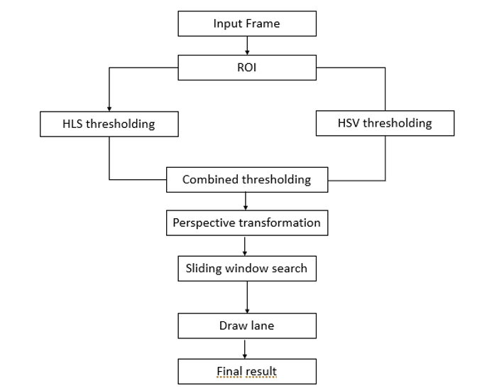

# Lane detection


# ⚙ How it works

## Lane detection overview
<p align="center">
  
</p>


1. **Get the current frame** from the video.
2. **Get the Region Of Interest** from the retrieved frame
3. **Apply thresholding** to supress background noise
   * **HLS** thresholding
   * **HSV** thresholding
4. **Combine the results** of the previous two thresholding
5. **Apply perspective transformation**
6. **Sliding window search** to detect lane pixels
7. **Draw polynomial** on the filtered windows
8. **Sanity check** to save valid lanes for a few consequent frames and reuse it if the sanity check fails

For detailed description of how it works, please check out my publication on IEEE:
https://ieeexplore.ieee.org/abstract/document/10158539
---
# 📦 Installation

## This Repository

Download this repository by running:

```
git clone https://github.com/mrobert3456/Lane_detection.git
cd Lane_detection
```

## ⚡ Software Dependencies

This project utilizes the following packages:

* Python 3
* OpenCV 2
* Matplotlib
* Numpy
* Pandas
* h5py
* [Tensorflow-gpu](https://www.tensorflow.org/install/pip)
* [Filterpy](https://filterpy.readthedocs.io/en/latest/)

To setup the environment,you need to install [conda](https://docs.conda.io/projects/conda/en/latest/user-guide/install/index.html), then run the following commands:
```
conda env create -f environment.yaml
conda activate GPU_ENV
```


# 🚀 Usage

## Standard usage

To produce the output, with the lane lines (as shown in the clips above), simply run:

```
python main.py input_file.mp4
```

## Add Traffic Sign Recognition

The necessary model and weight files can be found here: https://drive.google.com/file/d/1nLjbzzL77rTNSduE5hl7cByP0lgvai2i/view?usp=sharing

These files need to be placed under ``ts`` folder 
```
python main.py <input_file.mp4> combined
```

The output file will be saved as ```output.mp4```

